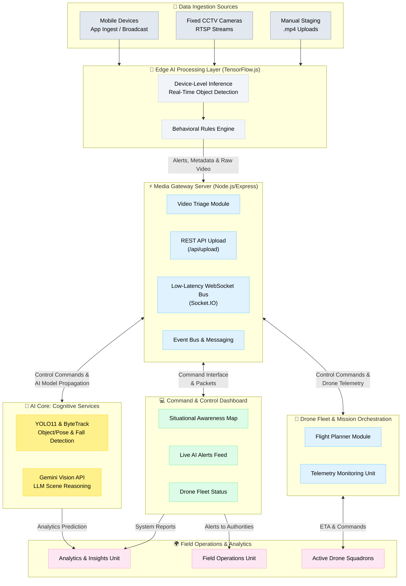

# 🚁 AI-Powered Drone Security & Emergency Response

  

A real-time, AI-driven command center built for modern first responders. This system integrates stationary CCTV feeds and autonomous drone video streams, utilizing YOLOv11 Pose Estimation to detect incidents (like a suspect surrendering) and automatically dispatch aerial assets to precise geographical coordinates via an interactive React-Leaflet dashboard.

---

## 🌟 Key Features

*   **🧠 Real-Time AI Inference:** Utilizes `ultralytics` YOLOv11-Pose to instantly detect human behaviors (e.g., raised hands/surrender) from raw video feeds.
*   **📡 Dual-Stream Command Center:** A Vite + React frontend dashboard capable of handling simultaneous WebSocket streams from both stationary CCTV and mobile drone units.
*   **📍 Live Geospatial Tracking:** Integrates `react-leaflet` to visualize live drone telemetry, dynamically tracking aerial assets across a city map.
*   **⚡ Automated Dispatch System:** When CCTV detects a critical incident, the Node.js backend instantly correlates the event and dispatches the nearest active drone to the exact coordinates.
*   **💻 Remote Process Management:** Administrators can launch and terminate separate Python video processing scripts directly from the React dashboard via a robust Node.js `child_process` backend.

---

## 🏗️ System Architecture

The project is divided into four core microservices:

1.  **`/backend` (Node.js & Express):** The central nervous system. Manages Socket.IO connections, handles REST API dispatch alerts, and controls the spawning of Python sub-processes.
2.  **`/frontend` (React + Tailwind + Vite):** The responder's Command Center. Features draggable resizable video modals (`react-rnd`), live map tracking, and an incident alert sidebar.
3.  **`/cameras` & `/drones` (Python + OpenCV):** The edge hardware. Captures video via IP Webcams or local webcams, runs YOLO inference, encodes frames to Base64, and pushes them to the Node.js server.
4.  **`/mobile_app` (React Native & Expo):** The on-ground responder application. Provides real-time alerts, live camera feeds, and geolocation tracking for field units.



---

## 🚀 Quick Start Guide

Follow these steps to get the Command Center running on your local machine.

### Prerequisites
*   [Node.js](https://nodejs.org/) (v16+)
*   [Python](https://www.python.org/downloads/) (3.9+)
*   [Git](https://git-scm.com/)

### 1. Clone the Repository
```bash
git clone https://github.com/AayushAade/AI-Powered-Drone-Security.git
cd AI-Powered-Drone-Security
```

### 2. Setup the Python Environment
```bash
# Install required ML and vision libraries
pip install ultralytics opencv-python numpy python-socketio requests
```
*(Ensure you have the YOLO weights (`yolo11n-pose.pt`, `yolo11n.pt`) placed in the `/project_assets` directory).*

### 3. Launch the Backend Server
```bash
cd backend
npm install
npm run start
# Runs on http://localhost:3000
```

### 4. Launch the Frontend Dashboard
Open a new terminal window:
```bash
cd frontend
npm install
npm run dev
# Runs on http://localhost:5173
```

### 5. Start the AI Feeds
1. Open the dashboard at `http://localhost:5173`.
2. Click **"LAUNCH CCTV CAM"** to start the stationary posture-detection feed.
3. Click **"LAUNCH DRONE CAM"** to start the mobile tracking feed.

*(Note: The Python scripts are currently configured to look for an IP Webcam stream at `http://192.0.0.4:8080`. Update `video_url` in the respective Python files to match your hardware).*

### 6. Start the Mobile Application (Optional)
To run the responder's app on your phone or emulator:
```bash
cd mobile_app
npm install
npx expo start
```
*(Scan the QR code with Expo Go on your mobile device to test).*

---

## 🛠️ Built With

*   **Frontend:** React, Vite, Tailwind CSS, React-Leaflet, React-RND
*   **Mobile App:** React Native, Expo, Socket.IO Client
*   **Backend:** Node.js, Express, Socket.IO
*   **AI/CV:** Python, OpenCV, Ultralytics YOLOv11

---

*Built for Hackathon Innovation.*
