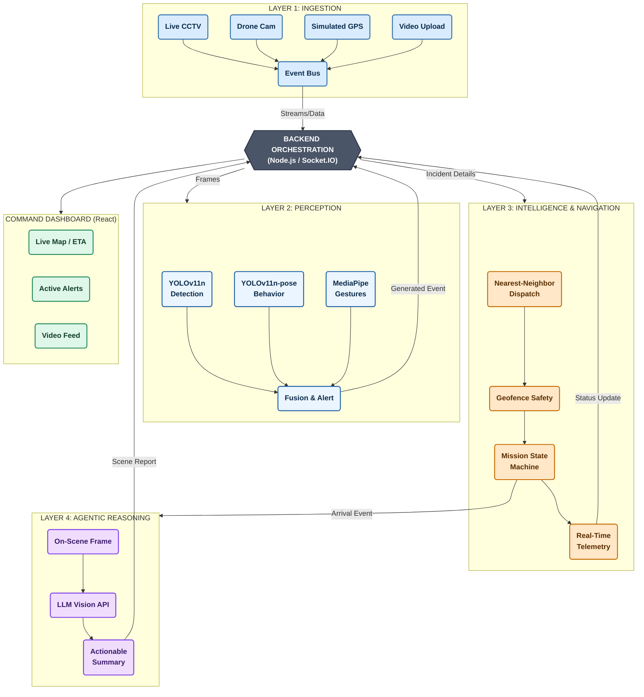

# Presentation Architecture Diagram

Use this specific syntax if your presentation software supports Mermaid, or drop it into a tool like [Mermaid Live Editor](https://mermaid.live/) to export a high-res PNG for your slides.

